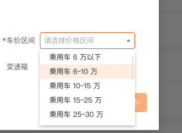
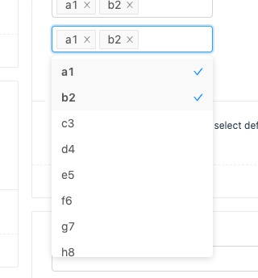

## Select 组件

## 需求分析
- 下拉选择器，弹出下拉菜单给用户选择操作，用于替代原生的选择器

## 原型图
;

- 单选下拉菜单，选项可以被 disable

;
- 多选菜单，可以选择多个条目

具体可以参考
[antdesign](https://www.antdv.com/components/select/

1 支持单选多选两种模式
2 input 框不能手动输入，点击选项以后自动填入对应 value
3 多选模式下，点击可以添加一项，再次点击就取消这一项，点击 tag 上面的 X 也可以删除这一项
4 注意暴露足够多的回调函数，比如 onVisibleChange 在下拉菜单，显示隐藏的时候被调用，还有 onChange，在选中值发生变化的时候被触发，并且参数应该有当前选择的是哪几项。
5 合理设计组件结构，注意组件结构语义化。(可以参考 menu 以及menuItem 或者自己参考ant design 源码)